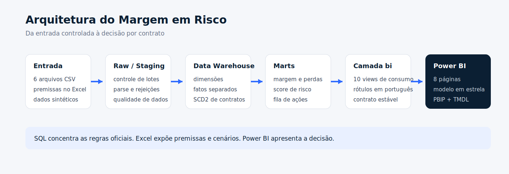

# Margem em Risco

Projeto de BI para acompanhar a rentabilidade de contratos recorrentes de
facilities.

Usei uma empresa fictícia, a Atlas Serviços Integrados, para montar um cenário
com contratos de limpeza, portaria, recepção, manutenção e apoio
administrativo. O problema analisado é comum: o faturamento cresce, mas alguns
contratos perdem margem por falhas operacionais, reajustes atrasados, problemas
de SLA ou escopo executado sem cobrança.

O projeto foi construído para localizar esses contratos, explicar a causa e
organizar uma fila de ação.

**[Abrir o dashboard interativo no Power BI](https://app.powerbi.com/view?r=eyJrIjoiMjEwZTZlOTQtZGYxNS00NTQ2LTllZjktZDc4YTNmZWRjYjcwIiwidCI6ImU4YjMwMjkyLTk1OTktNGU5Ni1hZDMwLTljODBjZDM3YWIyNCJ9)**



## O que foi construído

- carga e tratamento no SQL Server;
- modelo dimensional com fatos separados;
- histórico sintético de julho de 2024 a junho de 2026;
- regras de margem, risco e priorização;
- simulador de premissas no Excel;
- relatório Power BI em formato PBIP;
- oito páginas com navegação lateral;
- testes de estrutura, granularidade e reconciliação.

## Dashboard

O relatório publicado está disponível em [Power BI](https://app.powerbi.com/view?r=eyJrIjoiMjEwZTZlOTQtZGYxNS00NTQ2LTllZjktZDc4YTNmZWRjYjcwIiwidCI6ImU4YjMwMjkyLTk1OTktNGU5Ni1hZDMwLTljODBjZDM3YWIyNCJ9).

A navegação foi organizada em oito páginas:

1. Central Executiva
2. Portfólio de Contratos
3. Contrato 360º
4. Eficiência Operacional
5. Qualidade e SLA
6. Reajustes e Renovação
7. Efeito das Ações
8. Metodologia

As capturas finais serão adicionadas em `assets/dashboard`.

## Estrutura

```text
assets/       imagens e capturas do dashboard
data/         arquivos usados na carga inicial
docs/         arquitetura, regras e modelo
excel/        premissas e simulador
powerbi/      projeto PBIP, relatório e modelo semântico
scripts/      instalação, validação e abertura
sql/          carga, marts, histórico, camada BI e testes
```

## Executar localmente

Pré-requisitos:

- SQL Server local;
- `sqlcmd`;
- PowerShell;
- Power BI Desktop;
- Excel.

Instalação completa:

```powershell
powershell `
  -ExecutionPolicy Bypass `
  -File ".\scripts\instalar.ps1"
```

Validação:

```powershell
powershell `
  -ExecutionPolicy Bypass `
  -File ".\scripts\validar.ps1"
```

Abrir o relatório:

```powershell
powershell `
  -ExecutionPolicy Bypass `
  -File ".\scripts\abrir-powerbi.ps1"
```

Mais detalhes em [`docs/execucao.md`](docs/execucao.md).

## Decisões do projeto

- o SQL concentra as regras oficiais;
- o Excel é usado para premissas e cenários;
- o Power BI consome uma camada própria de views;
- os marts foram materializados para evitar cadeias profundas de views;
- o score é uma regra auditável, não um modelo preditivo;
- os dados são sintéticos e reproduzíveis.

## Documentação

- [Arquitetura](docs/arquitetura.md)
- [Regras de negócio](docs/regras-negocio.md)
- [Modelo de dados](docs/modelo-dados.md)
- [Dicionário de dados](docs/dicionario-dados.md)
- [Execução local](docs/execucao.md)
- [Validação](docs/validacao.md)

## Observações

Este é um projeto de portfólio. Os dados não pertencem a uma empresa real e as
regras precisariam ser recalibradas antes de uso em produção.

**André Massa**
