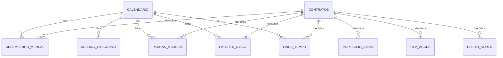

# Modelo de dados

O modelo semântico usa duas dimensões conformadas e fatos com granularidades
separadas.

## Tabelas do modelo

| Tabela | Granularidade | Uso |
|---|---|---|
| Calendário | Um registro por dia | Filtros de tempo e cálculos temporais. |
| Contratos | Um registro por contrato vigente | Dimensão conformada para cliente, serviço, gestor e atributos contratuais. |
| Desempenho Mensal | Um registro por contrato e competência | Receita, custo, margem, operação, pessoas, SLA e reajustes. |
| Efeito das Ações | Um registro por ação concluída | Comparação antes/depois de ações concluídas. |
| Fatores de Risco | Um registro por contrato, competência e fator | Componentes explicáveis do score. |
| Fila de Ações | Um registro por contrato na fila atual | Recomendação principal, justificativa, impacto e prioridade. |
| Linha do Tempo | Um registro por evento de contrato | Eventos operacionais, comerciais e gerenciais por contrato. |
| Métricas | Tabela calculada sem granularidade física | Medidas DAX centralizadas e organizadas por pasta. |
| Perdas de Margem | Um registro por contrato, competência e causa de perda | Ponte entre causas, perda identificada e recuperação possível. |
| Portfólio Atual | Um registro por contrato na competência mais recente | Fotografia atual usada nos cards, dispersões e priorização. |
| Resumo Executivo | Um registro por competência | Agregados mensais do portfólio. |

## Decisões de modelagem

- Contratos têm chave substituta para preservar histórico.
- O primeiro dia do mês representa a competência.
- Percentuais são armazenados entre `0` e `1`.
- Tabelas fato não são combinadas em uma única estrutura ampla.
- Medidas ficam centralizadas em `Métricas`.
- O modelo desencoraja agregações implícitas.
- A camada `bi` funciona como contrato entre o SQL e o Power BI.
